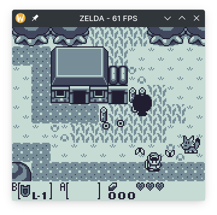
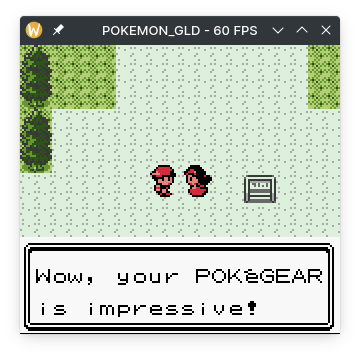
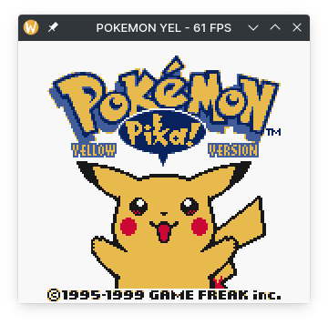

<h1><p align="center"> Good Boy 🐶 </p></h1>

<p align="center"> 
    A Game Boy emulator in Rust <br />
    <small> Sound not included </small>
</p>

<p align="center"> Web version is available at https://sixels.github.io/GoodBoy </p>

<div align="center">
    
    <br />
    <small> Game: Pokémon Red </small>
</div>

## Features

This emulator is not perfect and lack some features. Core features that are worthy listing:

- Pass Blargg's cpu_instrs tests
- Needs a little more improvements to pass dmg_acid test, but is still doing well
- Joypad implemented
- Support to MBC0, MBC1, MBC3 (without timer) and MBC5 (without rumble) cartridges
- Runs on browser (Experimental, not ready yet)
- Partial CGB support (Game Boy Color)

## Controls

Basic keyboard bindings

| Keyboard Key        | Game Boy Button |
| ------------------- | :-------------: |
| <kbd>Z</kbd>        |        A        |
| <kbd>X</kbd>        |        B        |
| <kbd>↵ Return</kbd> |      Start      |
| <kbd>Space</kbd>    |     Select      |
| <kbd>←</kbd>        |      Left       |
| <kbd>→</kbd>        |      Right      |
| <kbd>↑</kbd>        |       Up        |
| <kbd>↓</kbd>        |      Down       |

Other bindings:

| Keyboard Key                        |        Action        |
| ----------------------------------- | :------------------: |
| <kbd>Tab</kbd>                      |   Next Colorscheme   |
| <kbd>Esc</kbd>                      |     Open a game      |
| <kbd>⇧ Shift</kbd> + <kbd>Tab</kbd> | Previous Colorscheme |
| <kbd>Ctrl</kbd> + <kbd>Q</kbd>      |         Exit         |

Some keybindings are exclusive for native builds

## See it in action

### In-game screenshots

<div align="center">
    <table>
        <tr>
            <td>
                
                <br />
                <small> Game: The Legend of Zelda: Link’s Awakening </small>
            </td>
            <td>
                
                <br />
                <small> Game: Pokémon Gold </small>
            </td>
        </tr>
        <tr>
            <td>
                
                <br />
                <small> Game: Super Mario Land 2 </small>
            </td>
            <td>
                
                <br />
                <small> Game: Pokémon Yellow </small>
            </td>
        </tr>
    </table>
</div>

## How do i run it on my machine?

First, clone and cd to the project:

```sh
git clone https://github.com/sixels/goodboy && cd goodboy
```

It is supposed to be cross platform (however I tested it only on Linux). Setup Rust and Cargo on your machine then build the project:

```sh
cargo build --release
```

run with:

```sh
./target/release/goodboy [PATH/TO/ROM.gb]
```
