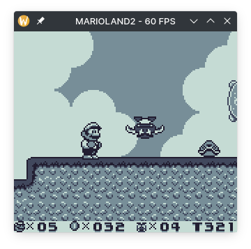

<h1><p align="center"> Good Boy 🐶 </p></h1>

<p align="center"> 
    A Game Boy emulator in Rust <br />
    <small> Sound not included </small>
</p>

<div align="center">
    
    <br />
    <small> Game: Pokémon Red </small>
</div>

## Features

This emulator is not perfect and lack some features. Core features that are worthy listing:

- Pass Blargg's cpu_instrs tests
- Needs a little more improvements to pass dmg_acid test, but is still doing well
- Joypad implemented
- Support to MBC0, MBC1, MBC3 (without timer) and MBC5 (without rumble) cartridge
- Runs on browser (Experimental not ready yet)

There are also some non-core features implemented just for fun:

- FPS counter overlay
- Support for multiple color schemes

Planned features:

- CLI arguments
- Quick save/load state
- Implement MBC3 timer
- SGB support (Super Game Boy)
- CGB support (Game Boy Color)
- Sound support
- A better FPS overlay (maybe)

## Controls

Basic keyboard bindings

| Keyboard Key        | Game Boy Button |
| ------------------- | :-------------: |
| <kbd>Z</kbd>        |        A        |
| <kbd>X</kbd>        |        B        |
| <kbd>↵ Return</kbd> |      Start      |
| <kbd>Space</kbd>    |     Select      |
| <kbd>←</kbd>        |      Left       |
| <kbd>→</kbd>        |      Right      |
| <kbd>↑</kbd>        |       Up        |
| <kbd>↓</kbd>        |      Down       |

Other bindings:

| Keyboard Key                        |        Action         |
| ----------------------------------- | :-------------------: |
| <kbd>F1</kbd>                       | Disable the FPS limit |
| <kbd>Tab</kbd>                      |   Next Colorscheme    |
| <kbd>⇧ Shift</kbd> + <kbd>Tab</kbd> | Previous Colorscheme  |
| <kbd>Ctrl</kbd> + <kbd>Q</kbd>      |         Exit          |

## See it in action

### Changing color schemes on the fly!

<div align="center">
    
    <br />
    <small> Game: The Legend of Zelda: Link's Awekening </small>
</div>

### In-game screenshots

<div align="center">
    <table>
        <tr>
            <td>
                
                <br />
                <small> Game: Dr Mario </small>
            </td>
            <td>
                
                <br />
                <small> Game: Disco Elysium (Demake) </small>
            </td>
            <td>
                
                <br />
                <small> Game: Super Mario Land 2 </small>
            </td>
        </tr>
    </table>
</div>

## How do i run it on my machine?

First, clone and cd to the project (Duh):

```sh
git clone https://github.com/sixels/goodboy && cd goodboy
```

It is supposed to be cross platform (however I tested it only on Linux). Setup Rust and Cargo then build the project:

```sh
cargo +nightly build --release
```

run with:

```sh
./target/release/goodboy PATH/TO/ROM.gb
```

## Running on browser

Use my script to compile the project to wasm32 (you will need to install [wasm-bindgen cli](https://rustwasm.github.io/wasm-bindgen/reference/cli.html) before):

```sh
sh ./build_wasm.sh release
```

You can now host the directory target/wasm_bindings (Here I'm using Python's http module
because of its simplicity, but you can use whatever works for you):

```sh
python3 -m http.server --directory target/wasm_bindings 8080
```

Open your browser and go to [localhost:8080](http://localhost:8080)
